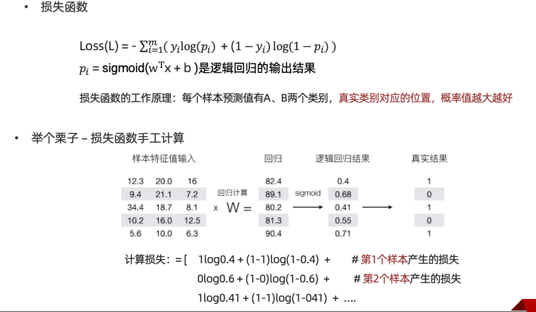
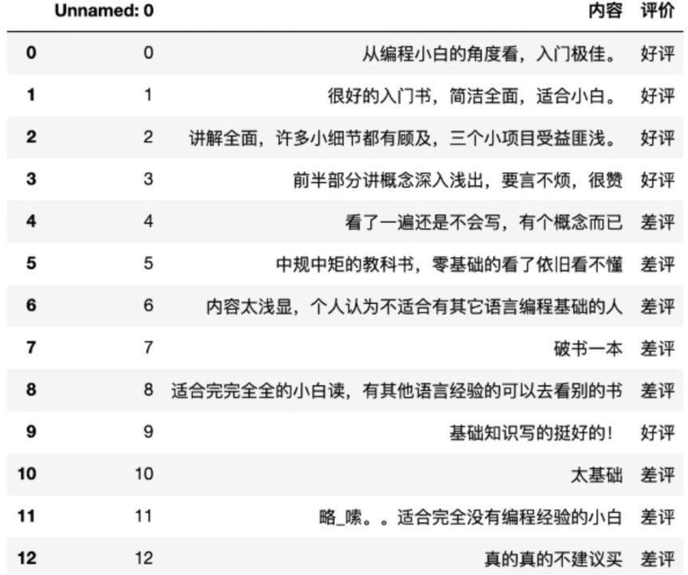
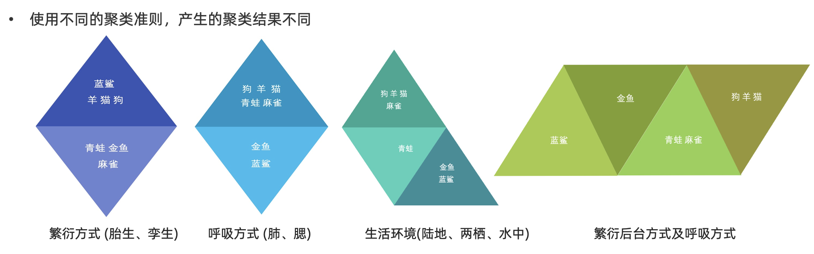
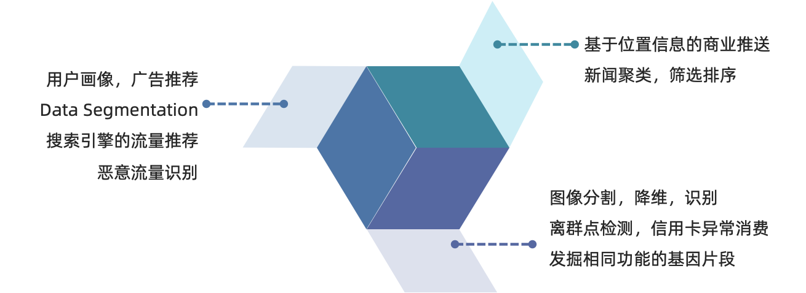
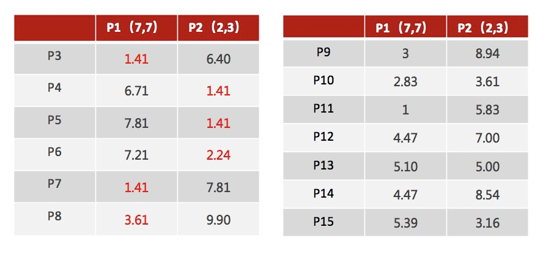
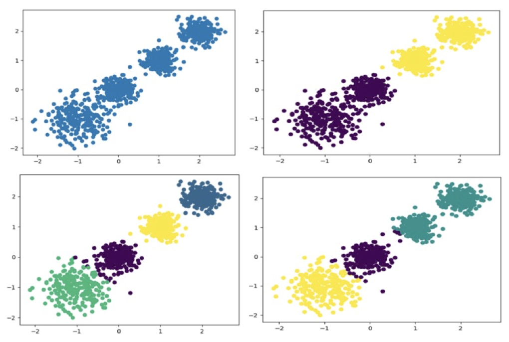
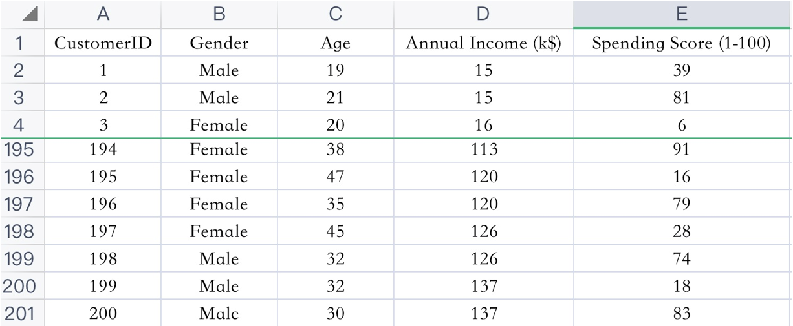
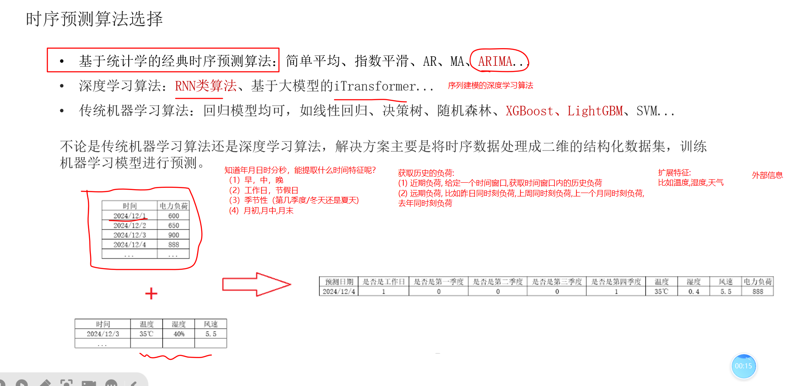

# 机器学习：从基础到聚类、树模型与时序预测

## 目录

1. 机器学习概述
2. 数据、特征工程与模型评估
3. K 近邻（KNN）
4. 线性回归
5. 逻辑回归与分类评估
6. 朴素贝叶斯
7. 决策树
8. 集成学习、随机森林与 AdaBoost
9. GBDT
10. XGBoost
11. 聚类与 K-Means
12. 时间序列与电力负荷预测
13. 算法选型与复习清单

---

# 1. 机器学习概述

## 1.1 AI、ML 与 DL

- **人工智能（AI）**：研究和构造能够感知、推理、决策、学习并执行任务的智能系统。
- **机器学习（ML）**：让计算机从数据中学习规律，而不是为每种情况手写完整规则。
- **深度学习（DL）**：机器学习的一个分支，主要使用多层神经网络学习表示。

三者关系：

$$
\text{深度学习}\subset\text{机器学习}\subset\text{人工智能}
$$

规则系统适合规则明确、稳定、可穷举的问题；图像、语音、自然语言等任务很难写全 `if-else`，更适合从数据训练模型。

## 1.2 简史、应用与发展条件

- 1956 年达特茅斯会议通常被视为人工智能学科诞生的标志。
- 早期以符号主义和专家系统为主；随后统计学习、SVM 等方法兴起。
- 2012 年 AlexNet 推动深度学习复兴，2017 年 Transformer 出现，之后进入大规模预训练模型阶段。
- 典型应用：搜索与推荐、用户分析、图像/语音识别、机器翻译、生物信息、自动驾驶、金融风控、时序预测、多模态与 AR/VR。

AI 发展的三项基础是：

- **数据**：提供经验；
- **算法**：从数据提取规律；
- **算力**：CPU 擅长通用调度，GPU 擅长大规模并行数值运算，TPU 等加速器针对张量计算优化。

## 1.3 学习范式

| 范式 | 数据特点 | 目标 | 示例 |
|---|---|---|---|
| 监督学习 | 有特征 X 和标签 y | 学习 X → y | 分类、回归 |
| 无监督学习 | 只有 X | 发现结构 | 聚类、降维、异常检测 |
| 半监督学习 | 少量有标签＋大量无标签 | 降低标注成本 | 伪标签、一致性训练 |
| 强化学习 | 智能体与环境交互 | 最大化累计奖励 | 游戏、机器人、控制 |

强化学习的核心元素是智能体、状态、动作、奖励和策略；它不是普通监督学习中的“给定正确答案”。

## 1.4 常见术语

- **样本（sample）**：一行记录。
- **特征（feature）**：模型可用的输入信息，一般对应一列。
- **标签/目标（label/target）**：要预测的结果。
- **参数（parameter）**：训练得到，如线性回归的 w, b。
- **超参数（hyperparameter）**：训练前设定，如 KNN 的 k、树深、学习率。
- **训练集**：拟合参数；**验证集**：选择模型和超参数；**测试集**：只用于最终无偏评估。
- **泛化**：模型在未见数据上的表现。

监督学习的两个主要任务：

- **分类**：输出离散类别，如电影类型、是否流失；
- **回归**：输出连续数值，如房价、电力负荷。

配套电影分类数据如下，最后一行是待预测样本：


## 1.5 标准建模流程

1. 明确业务目标、预测时点和评价成本。
2. 收集数据，定义样本、特征与标签。
3. 探索数据：类型、分布、缺失、异常、重复、类别不平衡。
4. 先划分训练/验证/测试，再拟合预处理器。
5. 特征工程：提取、清洗、编码、缩放、选择、组合或降维。
6. 建立简单基线，再训练候选模型。
7. 在训练集内部交叉验证和调参。
8. 在测试集只评估一次，并结合业务指标解释结果。
9. 保存“预处理＋模型”，部署、监控漂移并定期重训。

## 1.6 欠拟合、过拟合与偏差—方差

- **欠拟合**：训练误差和验证误差都高，通常模型太简单、特征不足或优化不充分。
- **过拟合**：训练误差很低而验证误差明显更高，通常模型过复杂、样本太少、噪声较多或发生泄漏。
- **合理拟合**：训练和验证表现都较好，差距可接受。

常见处理：

- 欠拟合：增加有效特征、提高模型容量、降低正则强度、训练更充分。
- 过拟合：增加数据、交叉验证、简化模型、正则化、剪枝、特征选择、早停或数据增强。

奥卡姆剃刀的实践含义是：若泛化效果相近，优先选择更简单、稳定、易解释的模型。

---

# 2. 数据、特征工程与模型评估

## 2.1 必要数学基础

- 标量：单个数；向量：一维有序数组；矩阵：二维数组；张量：更高维数组。
- 导数描述单变量函数的局部变化率；偏导描述多变量函数对某一变量的变化率。
- 梯度是各偏导组成的向量：

$$
\nabla_w J=\left[
\frac{\partial J}{\partial w_1},\ldots,
\frac{\partial J}{\partial w_n}
\right]^\top
$$

常用求导规则：

$$
(x^a)'=ax^{a-1},\quad (e^x)'=e^x,\quad
(\ln x)'=\frac1x
$$

$$
(uv)'=u'v+uv',\qquad
\left(\frac uv\right)'=\frac{u'v-uv'}{v^2},\qquad
(g\circ h)'=g'(h(x))h'(x)
$$

导数为 0 只是可微内部极值的必要条件之一，还可能是拐点；需要结合凸性、二阶导或边界判断。

## 2.2 特征工程

- **提取**：把文本、图片、时间等原始对象转为数值特征。
- **预处理**：缺失值填补、异常处理、类别编码、数值缩放。
- **选择**：保留原特征的子集，不改变其含义。
- **降维**：把原特征映射到低维空间，通常会改变含义并损失部分信息，如 PCA。
- **组合**：构造交互项、比值、统计量、多项式项、时间滞后项。

特征工程应只利用预测时刻真正可获得的信息。任何使用未来标签、全体数据统计量或测试集信息的操作都属于泄漏。

## 2.3 归一化与标准化

Min-Max 归一化到 [a, b]：

$$
x'=a+\frac{x-x_{\min}}{x_{\max}-x_{\min}}(b-a)
$$

它对极端值敏感。标准化为：

$$
z=\frac{x-\mu}{\sigma}
$$

标准化对 KNN、SVM、线性模型的梯度优化和正则化非常重要；树模型通常不依赖尺度。若异常值很多，可考虑 `RobustScaler`。

## 2.4 数据划分、交叉验证与网格搜索

普通独立同分布数据可随机划分；分类任务常使用 `stratify=y` 保持类别比例。K 折交叉验证依次用一折验证、其余折训练，最终取平均指标。测试集不能参与超参数选择。

网格搜索枚举参数组合，并在训练集内部交叉验证。`GridSearchCV(refit=True)` 默认会用最佳参数在全部训练数据上重训，可直接 `predict`，无需手工再建一个模型。

正确的无泄漏模板：

```python
from sklearn.model_selection import train_test_split, GridSearchCV
from sklearn.pipeline import Pipeline
from sklearn.preprocessing import StandardScaler
from sklearn.neighbors import KNeighborsClassifier

X_train, X_test, y_train, y_test = train_test_split(
    X, y, test_size=0.2, stratify=y, random_state=22
)

pipe = Pipeline([
    ("scale", StandardScaler()),
    ("model", KNeighborsClassifier())
])

search = GridSearchCV(
    pipe,
    {"model__n_neighbors": range(1, 20),
     "model__weights": ["uniform", "distance"]},
    cv=5,
    scoring="accuracy",
    n_jobs=-1
)
search.fit(X_train, y_train)
print(search.best_params_, search.score(X_test, y_test))
```

---

# 3. K 近邻（KNN）

## 3.1 核心思想

KNN 不显式拟合参数，而是保存训练数据。预测时找到距离最近的 k 个样本：

- 分类：多数投票或距离加权投票；
- 回归：目标均值或距离加权均值。

分类预测可写为：

$$
\hat y=\arg\max_c\sum_{i\in N_k(x)}w_i\mathbf 1(y_i=c)
$$

其中均匀投票时 wᵢ = 1，距离加权时常取 wᵢ = 1/(dᵢ + ε)。

## 3.2 电影分类完整例子

待预测电影“唐人街探案”的特征是：搞笑镜头 23、拥抱镜头 3、打斗镜头 17。使用欧氏距离：

| 电影 | 类型 | 与待预测样本的距离（约） |
|---|---|---:|
| 美人鱼 | 喜剧片 | 18.55 |
| 功夫熊猫 | 喜剧片 | 21.47 |
| 宝贝当家 | 喜剧片 | 23.43 |
| 新步步惊心 | 爱情片 | 34.44 |
| 代理情人 | 爱情片 | 40.57 |
| 二次曝光 | 爱情片 | 43.42 |
| 谍影重重 | 动作片 | 43.87 |
| 叶问3 | 动作片 | 52.01 |

若 k = 3，最近三部都是喜剧片，因此预测为喜剧片。这个结论依赖特征尺度：若某列量级特别大，它会支配距离，所以通常先标准化。

## 3.3 距离度量

对 x, y ∈ ℝⁿ：

- 欧氏距离：

$$
d_2(x,y)=\sqrt{\sum_{j=1}^n(x_j-y_j)^2}
$$

- 曼哈顿距离：

$$
d_1(x,y)=\sum_{j=1}^n|x_j-y_j|
$$

- 切比雪夫距离：

$$
d_\infty(x,y)=\max_j|x_j-y_j|
$$

- 闵可夫斯基距离：

$$
d_p(x,y)=\left(\sum_{j=1}^n|x_j-y_j|^p\right)^{1/p}
$$

p = 1 是曼哈顿距离，p = 2 是欧氏距离。

## 3.4 k 的选择与特点

- k 太小：边界曲折，对噪声敏感，低偏差、高方差，易过拟合。
- k 太大：邻居过多，局部结构被抹平，高偏差、易欠拟合。
- 二分类常尝试奇数 k 减少平票，但多分类仍可能平票；最终应通过交叉验证选择。

优点：直观、无需复杂训练、可用于分类和回归。缺点：预测慢、内存开销大、对尺度和无关特征敏感；高维下距离区分度下降，即“维数灾难”。

## 3.5 API 与案例

```python
from sklearn.neighbors import KNeighborsClassifier, KNeighborsRegressor

clf = KNeighborsClassifier(n_neighbors=5, weights="distance", p=2)
reg = KNeighborsRegressor(n_neighbors=5, weights="distance", p=2)
```

鸢尾花：150 个样本、3 类、4 个特征，适合用“分层切分＋标准化＋KNN＋交叉验证”。手写数字：每张图 28 × 28 = 784 个像素，像素常除以 255；KNN 可作为基线，但在大数据和高维下预测较慢。

```python
from sklearn.datasets import load_iris
from sklearn.model_selection import train_test_split
from sklearn.pipeline import make_pipeline
from sklearn.preprocessing import StandardScaler
from sklearn.neighbors import KNeighborsClassifier

X, y = load_iris(return_X_y=True)
X_tr, X_te, y_tr, y_te = train_test_split(
    X, y, test_size=0.2, stratify=y, random_state=22
)
model = make_pipeline(StandardScaler(), KNeighborsClassifier(n_neighbors=5))
model.fit(X_tr, y_tr)
print(model.score(X_te, y_te))
```

---

# 4. 线性回归

## 4.1 模型

一元线性回归：

$$
\hat y=wx+b
$$

多元线性回归：

$$
\hat y=w_1x_1+\cdots+w_nx_n+b=Xw+b
$$

例如从身高预测体重，模型先从历史身高—体重数据中学习斜率和截距，再输入新身高得到预测。线性回归适合趋势近似线性、需要解释系数或需要简单基线的回归任务。

## 4.2 最小二乘损失

残差定义为：

$$
e_i=y_i-\hat y_i
$$

普通最小二乘最小化残差平方和或 MSE：

$$
J(w,b)=\frac1{2m}\sum_{i=1}^m(\hat y_i-y_i)^2
$$

平方使正负误差不会抵消，并对大误差惩罚更强。若噪声独立且服从零均值同方差高斯分布，最小二乘也等价于极大似然估计。

## 4.3 一元解析解

对 ∑ᵢ[yᵢ − (wxᵢ + b)]² 分别对 w, b 求偏导并令其为 0，可得：

$$
w=\frac{\sum_i(x_i-\bar x)(y_i-\bar y)}
{\sum_i(x_i-\bar x)^2},\qquad
b=\bar y-w\bar x
$$

斜率本质上是 x, y 的协方差与 x 方差之比。

## 4.4 多元正规方程

把截距并入增广矩阵 X̃ = [𝟙, X]，目标为：

$$
J(\theta)=\frac12\|\tilde X\theta-y\|_2^2
$$

求梯度：

$$
\nabla_\theta J=\tilde X^\top(\tilde X\theta-y)
$$

令梯度为 0：

$$
\tilde X^\top\tilde X\theta=\tilde X^\top y
$$

若矩阵可逆：

$$
\theta=(\tilde X^\top\tilde X)^{-1}\tilde X^\top y
$$

实践中通常使用 QR、SVD 或伪逆求解，避免显式求逆带来的数值不稳定。

## 4.5 梯度下降

对 MSE：

$$
\nabla_wJ=\frac1mX^\top(Xw+b-y),\qquad
\frac{\partial J}{\partial b}=\frac1m\sum_i(\hat y_i-y_i)
$$

更新：

$$
w\leftarrow w-\eta\nabla_wJ,\qquad
b\leftarrow b-\eta\frac{\partial J}{\partial b}
$$

- 批量梯度下降每轮用全部数据，稳定但大数据较慢。
- 随机梯度下降每次用一个样本，噪声大但更新快。
- 小批量梯度下降折中，也是深度学习常用方式。
- 学习率过大可能震荡或发散，过小则收敛慢；缩放特征可改善条件数和收敛速度。

## 4.6 回归指标

$$
MAE=\frac1m\sum_i|y_i-\hat y_i|
$$

$$
MSE=\frac1m\sum_i(y_i-\hat y_i)^2
$$

$$
RMSE=\sqrt{MSE}
$$

- MAE 与目标同单位、对异常值较稳健；
- MSE 可导且强烈惩罚大误差；
- RMSE 与目标同单位，但仍对大误差敏感；
- 同一批样本上总有 RMSE ≥ MAE；不同数据集或不同尺度上的指标不能直接比较。
- 还可报告 R² = 1 − ∑(yᵢ − ŷᵢ)² / ∑(yᵢ − ȳ)²。测试集 R² 可能为负，表示还不如预测均值。

## 4.7 正则化

L1（Lasso）：

$$
J_{L1}=J+\lambda\sum_j|w_j|
$$

L1 的次梯度含 λ sign(wⱼ)，容易把部分系数压到 0，产生稀疏解，可用于特征选择。

L2（Ridge）：

$$
J_{L2}=J+\frac\lambda2\sum_jw_j^2
$$

其梯度增加 λ wⱼ，通常把系数连续缩小而不是直接变为 0。正则化前应缩放特征，否则同一个惩罚对不同量纲不公平；通常不惩罚截距。

## 4.8 多项式拟合与过拟合

若真实关系是 y = 0.5x² + x + 2 + ε：

- 只用 x 的直线会欠拟合；
- 使用 x, x² 可表达真实趋势；
- 加到 x¹⁰ 可能把噪声也拟合进去，训练 MSE 继续下降但测试 MSE 上升。

应比较验证/测试误差，而不能根据训练误差判断是否过拟合。多项式与正则化的正确组合：

```python
from sklearn.pipeline import make_pipeline
from sklearn.preprocessing import PolynomialFeatures, StandardScaler
from sklearn.linear_model import Ridge

model = make_pipeline(
    PolynomialFeatures(degree=5, include_bias=False),
    StandardScaler(),
    Ridge(alpha=1.0)
)
```

## 4.9 sklearn 实践

```python
from sklearn.datasets import fetch_california_housing
from sklearn.model_selection import train_test_split
from sklearn.pipeline import make_pipeline
from sklearn.preprocessing import StandardScaler
from sklearn.linear_model import LinearRegression, SGDRegressor
from sklearn.metrics import mean_absolute_error, mean_squared_error

X, y = fetch_california_housing(return_X_y=True)
X_tr, X_te, y_tr, y_te = train_test_split(
    X, y, test_size=0.2, random_state=22
)

# 闭式/数值最小二乘本身不要求标准化
ols = LinearRegression().fit(X_tr, y_tr)

# SGD 对尺度敏感，应放入 Pipeline
sgd = make_pipeline(
    StandardScaler(),
    SGDRegressor(loss="squared_error", random_state=22)
).fit(X_tr, y_tr)

pred = sgd.predict(X_te)
print("MAE:", mean_absolute_error(y_te, pred))
print("RMSE:", mean_squared_error(y_te, pred) ** 0.5)
```

---

# 5. 逻辑回归与分类评估

## 5.1 从线性分数到概率

逻辑回归虽然名字含“回归”，但在机器学习中是分类模型。先计算线性分数：

$$
z=w^\top x+b
$$

再通过 Sigmoid 映射为正类概率：

$$
p(y=1\mid x)=\sigma(z)=\frac1{1+e^{-z}}
$$

Sigmoid 满足：

$$
\sigma'(z)=\sigma(z)[1-\sigma(z)]
$$

对概率取赔率和对数：

$$
\frac{p}{1-p}=e^z,
\qquad
\log\frac{p}{1-p}=w^\top x+b
$$

所以逻辑回归假设“对数赔率”是特征的线性函数。给定阈值 t，若 p ≥ t 预测为正类；t = 0.5 只是常用默认值，不是固定真理。漏诊代价高时常降低阈值，误报代价高时常提高阈值。

## 5.2 极大似然：硬币例子

一枚硬币正面概率为 θ，独立投 6 次得到 4 次正面、2 次反面。似然为：

$$
L(\theta)=\theta^4(1-\theta)^2
$$

对数似然为：

$$
\ell(\theta)=4\ln\theta+2\ln(1-\theta)
$$

求导并令其为 0：

$$
\ell'(\theta)=\frac4\theta-\frac2{1-\theta}=0
\Rightarrow\hat\theta=\frac46=\frac23
$$

原稿漏写了反面次数的平方；正确似然必须是 θ⁴(1−θ)²。

## 5.3 交叉熵损失的推导

对 yᵢ ∈ {0, 1}，单个样本的伯努利概率可统一写成：

$$
P(y_i\mid x_i)=p_i^{y_i}(1-p_i)^{1-y_i}
$$

独立样本的似然是连乘。最大化似然等价于最小化负对数似然：

$$
J(w,b)= -\frac1m\sum_{i=1}^m
[y_i\ln p_i+(1-y_i)\ln(1-p_i)]
$$

这就是二元交叉熵。其梯度具有非常简洁的形式：

$$
\nabla_wJ=\frac1mX^\top(p-y),
\qquad
\frac{\partial J}{\partial b}=\frac1m\sum_i(p_i-y_i)
$$

若 y = 1, p → 0 或 y = 0, p → 1，损失趋于无穷，模型会强烈惩罚“非常自信但错误”的预测。

配套截图中的二元交叉熵公式应按上式理解：



`image-20230904151300483(1).png` 与上图的 SHA-256 完全相同，因此不重复展示，但其内容已计入本节。

## 5.4 正则化与多分类

逻辑回归通常最小化：

$$
J_{reg}=J+\lambda R(w)
$$

`LogisticRegression` 中 `C` 与正则强度近似成反比：C ↓ ⇒ 正则更强。

多分类可使用：

- **One-vs-Rest**：每个类别与其余类别训练一个二分类器；
- **多项逻辑回归/Softmax**：

$$
P(y=k\mid x)=\frac{e^{z_k}}{\sum_{c=1}^Ke^{z_c}}
$$

## 5.5 混淆矩阵

设正类为“恶性”：

| 真实/预测 | 正类 | 负类 |
|---|---:|---:|
| 正类 | TP | FN |
| 负类 | FP | TN |

$$
Accuracy=\frac{TP+TN}{TP+TN+FP+FN}
$$

$$
Precision=\frac{TP}{TP+FP},\qquad
Recall=\frac{TP}{TP+FN}
$$

$$
F_1=\frac{2PR}{P+R}=\frac{2TP}{2TP+FP+FN}
$$

原稿例子中：

- 模型 A：TP = 3, FN = 3, FP = 0, TN = 4，Precision = 1，Recall = 0.5，F1 ≈ 0.667。
- 模型 B：TP = 6, FN = 0, FP = 3, TN = 1，Precision ≈ 0.667，Recall = 1，F1 = 0.8。

准确率在类别不平衡时可能失真。例如 99% 都是负类，永远预测负类也有 99% 准确率，但正类召回率为 0。

## 5.6 ROC 与 AUC

$$
TPR=\frac{TP}{TP+FN}=Recall,\qquad
FPR=\frac{FP}{FP+TN}
$$

ROC 以 FPR 为横轴、TPR 为纵轴，改变分类阈值得到曲线：

- (0, 0)：全部预测为负；
- (0, 1)：完美分类；
- (1, 1)：全部预测为正；
- 对角线附近约等于随机排序。

AUC 是 ROC 曲线下面积，也可解释为：随机抽取一对正、负样本，模型把正样本得分排在负样本之前的概率。二分类应使用：

```python
score = model.predict_proba(X_test)[:, 1]
auc = roc_auc_score(y_test, score)
```

不能把 `model.predict(X_test)` 的 0/1 类别传给 AUC，因为阈值化会丢掉排序信息。极度不平衡任务还应查看 Precision-Recall 曲线和 PR-AUC。

## 5.7 API 与案例

```python
from sklearn.datasets import load_breast_cancer
from sklearn.model_selection import train_test_split
from sklearn.pipeline import make_pipeline
from sklearn.preprocessing import StandardScaler
from sklearn.linear_model import LogisticRegression
from sklearn.metrics import classification_report, roc_auc_score

X, y = load_breast_cancer(return_X_y=True)
X_tr, X_te, y_tr, y_te = train_test_split(
    X, y, test_size=0.2, stratify=y, random_state=21
)
model = make_pipeline(
    StandardScaler(),
    LogisticRegression(C=1.0, max_iter=2000)
)
model.fit(X_tr, y_tr)
pred = model.predict(X_te)
prob = model.predict_proba(X_te)[:, 1]
print(classification_report(y_te, pred))
print("AUC:", roc_auc_score(y_te, prob))
```

原癌症 CSV 案例是 Wisconsin Original 数据：699 条、ID＋9 个医学特征＋类别，16 个 `?` 缺失值，标签 2/4 表示良性/恶性；可将 `?` 转为缺失后填补或删除。上面 sklearn 内置的是另一个 Wisconsin Diagnostic 版本，不应混称为同一数据表。

电信流失案例包含约 7043 条、21 个字段，包括客户信息、服务、合同、账单、消费和 `Churn`。严谨流程是：

1. `customerID` 通常只作标识，不作为直接特征；把 `TotalCharges` 转数值并处理缺失。
2. 先分层切分，再在 `ColumnTransformer` 中对数值填补/缩放、类别填补/One-Hot。
3. 在训练集交叉验证选择 `C`、类别权重和阈值。
4. 报告混淆矩阵、Precision、Recall、F1、ROC-AUC/PR-AUC，不只看准确率。

---

# 6. 朴素贝叶斯

## 6.1 从条件概率到贝叶斯公式

朴素贝叶斯是一个基于概率的监督分类算法。它要回答的问题是：**已知样本特征后，这个样本属于各类别的概率分别是多少？**

先区分几个基本概念：

- **先验概率** P(C)：还没有观察样本特征时，类别 C 出现的概率；
- **条件概率** P(A | B)：事件 B 已经发生时，事件 A 发生的概率；
- **联合概率** P(A, B)：事件 A 和 B 同时发生的概率；
- **似然** P(X | C)：已知类别为 C 时，观察到特征 X 的可能性；
- **后验概率** P(C | X)：观察特征 X 后，样本属于类别 C 的概率。

条件概率与联合概率的关系是：

$$
P(A\mid B)=\frac{P(A,B)}{P(B)},\qquad
P(A,B)=P(A\mid B)P(B)
$$

若 A、B 相互独立，才有 P(A, B) = P(A)P(B)。独立性不能在一般情况下随意假设。

若 C₁, …, C[K] 互斥且覆盖所有可能类别，全概率公式为：

$$
P(X)=\sum_{k=1}^{K}P(X\mid C_k)P(C_k)
$$

由此得到贝叶斯公式：

$$
P(C_k\mid X)
=\frac{P(X\mid C_k)P(C_k)}{P(X)}
=\frac{P(X\mid C_k)P(C_k)}
{\sum_{r=1}^{K}P(X\mid C_r)P(C_r)}
$$


可以把它记成：

$$
\text{后验}=\frac{\text{似然}\times\text{先验}}{\text{证据}}
$$

对同一个样本比较类别时，分母 P(X) 对所有类别相同，因此分类只需比较分子：

$$
\hat y=\arg\max_k P(X\mid C_k)P(C_k)
$$

注意：**分母只是在求最大类别时可以省略；若要得到归一化后的真实后验概率，仍须除以所有类别得分之和。**

## 6.2 原始样例：直接贝叶斯计算

原笔记中的 7 条样本如下：


例如：

$$
P(\text{程序员}\mid\text{喜欢})=\frac{2}{4}=0.5
$$

“程序员且体型匀称”的联合概率为：

$$
P(\text{程序员},\text{匀称})
=P(\text{程序员})P(\text{匀称}\mid\text{程序员})
=\frac37\times\frac13=\frac17
$$

现要预测“程序员、超重”被喜欢的概率：


训练集中“程序员、超重”共有样本 1 和 4，其中一个“喜欢”，所以直接统计得到：

$$
P(\text{喜欢}\mid\text{程序员},\text{超重})=\frac12
$$

也可以严格按贝叶斯公式计算：

$$
\begin{aligned}
P(\text{程序员},\text{超重}\mid\text{喜欢})&=\frac14,\\
P(\text{喜欢})&=\frac47,\\
P(\text{程序员},\text{超重})&=\frac27,\\
P(\text{喜欢}\mid\text{程序员},\text{超重})
&=\frac{(1/4)(4/7)}{2/7}=\frac12.
\end{aligned}
$$

这种联合频率法在特征很多时会遇到严重问题：特征组合数呈指数增长，大量组合在训练集中根本没有出现。

## 6.3 “朴素”条件独立假设

设样本有 d 个特征 X = (x₁, x₂, …, x[d])。朴素贝叶斯假设：**给定类别 Cₖ 后，各特征条件独立**：

$$
P(X\mid C_k)=\prod_{j=1}^{d}P(x_j\mid C_k)
$$

于是分类规则变为：

$$
\hat y
=\arg\max_k P(C_k)\prod_{j=1}^{d}P(x_j\mid C_k)
$$

这就是“朴素”的含义。它并不是假设所有特征在任何情况下都独立，而是假设它们在**类别已知的条件下**相互独立。

沿用上例，在该假设下：

$$
\begin{aligned}
s_{\text{喜欢}}
&=\frac47\times\frac24\times\frac14=\frac1{14},\\
s_{\text{不喜欢}}
&=\frac37\times\frac13\times\frac23=\frac2{21}.
\end{aligned}
$$

归一化后：

$$
P(\text{喜欢}\mid X)\approx
\frac{1/14}{1/14+2/21}=\frac37\approx0.429
$$

这与直接联合统计得到的 0.5 不同，正是条件独立近似带来的误差。现实特征往往相关，但该近似能大幅降低估计难度，在文本等高维稀疏任务中经常仍然有效。

大量小概率连续相乘容易发生浮点下溢，因此实现时通常比较对数得分：

$$
\log s_k=\log P(C_k)+\sum_{j=1}^{d}\log P(x_j\mid C_k)
$$

对数函数单调递增，不会改变最大值对应的类别。

## 6.4 拉普拉斯与 Lidstone 平滑

若某个词从未在某一类别出现，则对应条件概率为 0，连乘后整个类别得分都会变成 0。平滑通过给计数增加一个小的伪计数解决这个问题。

对多项式朴素贝叶斯，词 w 在类别 c 下的平滑估计为：

$$
P(w\mid c)=\frac{N_{wc}+\alpha}{N_c+\alpha|V|}
$$

其中：

- N[w,c]：类别 c 中词 w 的出现次数；
- N[c]：类别 c 中所有词的总出现次数；
- |V|：词表大小；
- α > 0：平滑强度，α = 1 称为拉普拉斯平滑，0 < α < 1 常称为 Lidstone 平滑。

分母必须加 α|V|，这样所有词的条件概率之和仍等于 1。对离散类别特征，|V| 应替换为该特征可能的取值数。原笔记中把它笼统写成“所有独立样本数”并不准确。

平滑越强，概率越向均匀分布收缩；它解决的是零概率和小样本估计不稳定问题，不等同于逻辑回归中的参数正则化。

## 6.5 常见模型变体

| 模型 | 特征假设 | 典型场景 | 关键要求 |
|---|---|---|---|
| `GaussianNB` | 每类中各连续特征近似高斯分布 | 测量值、医学指标、小型表格数据 | 特征可以为任意实数 |
| `MultinomialNB` | 特征是事件/词的非负计数 | 词袋文本分类、主题分类 | 输入必须非负；词频最符合模型假设，TF-IDF 也常有效 |
| `BernoulliNB` | 特征是出现/未出现的二值变量 | 短文本、二值问卷 | 关注“有没有”，而非出现多少次 |
| `ComplementNB` | 用其他类别的统计量修正权重 | 类别不平衡的文本分类 | 常作为 `MultinomialNB` 的对照 |
| `CategoricalNB` | 每个特征服从类别分布 | 颜色、职业、等级等离散字段 | 类别值需编码为非负整数 |

高斯朴素贝叶斯对第 k 类、第 j 个特征估计均值 μₖⱼ 和方差 σₖⱼ²：

$$
P(x_j\mid C_k)=
\frac{1}{\sqrt{2\pi\sigma_{kj}^2}}
\exp\left[-\frac{(x_j-\mu_{kj})^2}{2\sigma_{kj}^2}\right]
$$

“高斯”只是对每个特征的类条件分布作假设，并不代表所有原始数据整体必须服从一个高斯分布。

## 6.6 文本分类为什么适合朴素贝叶斯

词袋模型把文档转换为长度为 |V| 的向量：第 j 维是词 wⱼ 的出现次数。虽然词语之间显然相关，但文本通常具有以下特点：

- 维度高、矩阵稀疏；
- 单个类别常由一组高频关键词共同表征；
- 需要快速训练一个可靠基线；
- 数据量不大时，复杂模型未必稳定。

多项式朴素贝叶斯只需统计类别频率和“类别—词”频率，训练与预测都很快，也不要求对词频做标准化。

一个微型例子：正面评论共含 8 个词，其中“很赞”出现 2 次；负面评论共含 10 个词，“很赞”从未出现。若词表大小为 6，使用 α = 1：

$$
P(\text{很赞}\mid\text{正面})=\frac{2+1}{8+6}=\frac3{14},\qquad
P(\text{很赞}\mid\text{负面})=\frac{0+1}{10+6}=\frac1{16}
$$

因此“很赞”会提高正面类别的相对得分；因为有平滑，负面类别的得分也不会直接归零。

## 6.7 商品评论情感分析：完整实践

原始数据包含“内容”和“评价”两列，目标是根据评论文本预测“好评/差评”。



正确流程是：

1. 读取评论和标签，清理空值、重复项及无意义索引列。
2. **先划分训练集和测试集**，并按标签分层。
3. 在训练流程内部完成分词、词表学习和词频转换，防止测试集词汇泄漏。
4. 训练 `MultinomialNB`，输出分类指标和混淆矩阵。
5. 数据很少时，增加样本并使用分层交叉验证；13 条评论只能演示流程，不能证明模型可靠。

```python
from pathlib import Path

import jieba
import pandas as pd
from sklearn.feature_extraction.text import CountVectorizer
from sklearn.metrics import classification_report, confusion_matrix
from sklearn.model_selection import train_test_split
from sklearn.naive_bayes import MultinomialNB
from sklearn.pipeline import Pipeline

# 1. 读取并清理数据
data = pd.read_csv("./data/书籍评价.csv", encoding="gbk")
data = data[["内容", "评价"]].dropna().drop_duplicates()
data["标签"] = data["评价"].map({"好评": 1, "差评": 0})
data = data.dropna(subset=["标签"])

stopwords = {
    line.strip()
    for line in Path("./data/stopwords.txt").read_text(
        encoding="utf-8"
    ).splitlines()
    if line.strip()
}

X_train, X_test, y_train, y_test = train_test_split(
    data["内容"],
    data["标签"].astype(int),
    test_size=0.3,
    stratify=data["标签"],
    random_state=42,
)

# 2. 词袋转换和模型必须一起放进 Pipeline
model = Pipeline([
    ("vectorizer", CountVectorizer(
        tokenizer=jieba.lcut,
        token_pattern=None,
        stop_words=list(stopwords),
    )),
    ("nb", MultinomialNB(alpha=1.0)),
])

# 3. 训练、预测和评估
model.fit(X_train, y_train)
pred = model.predict(X_test)
prob = model.predict_proba(X_test)

print(confusion_matrix(y_test, pred))
print(classification_report(y_test, pred, zero_division=0))
print("类别顺序：", model.named_steps["nb"].classes_)
print("第一条测试评论的类别概率：", prob[0])

# 当前 sklearn 获取词表的接口；旧版 get_feature_names() 已弃用/移除
terms = model.named_steps["vectorizer"].get_feature_names_out()
print("词表大小：", len(terms))
```

原笔记先对全部文本执行 `fit_transform`，再切训练/测试，这会让测试集参与词表学习；固定使用前 10 条训练、后 3 条测试也容易受到数据顺序影响。上面的 `Pipeline` 和分层随机切分修复了这两个问题。

若数据量足够，可用分层交叉验证比较 `alpha`：

```python
from sklearn.model_selection import GridSearchCV, StratifiedKFold

cv = StratifiedKFold(n_splits=5, shuffle=True, random_state=42)
search = GridSearchCV(
    model,
    {"nb__alpha": [0.01, 0.1, 0.5, 1.0, 2.0]},
    scoring="f1",
    cv=cv,
    n_jobs=-1,
)
search.fit(data["内容"], data["标签"].astype(int))
print(search.best_params_, search.best_score_)
```

只有 13 条样本时不能使用 5 折，除非每个类别至少有 5 条且每折划分合理；更重要的是先补充数据。类别不平衡时应同时查看 Precision、Recall、F1、PR-AUC，并与 `ComplementNB`、逻辑回归等基线比较。

当前模型变体、公式和参数以 [scikit-learn 朴素贝叶斯官方文档](https://scikit-learn.org/stable/modules/naive_bayes.html) 为准。

## 6.8 优点、局限与使用建议

优点：

- 训练和预测速度快，内存开销小；
- 对高维稀疏文本尤其友好；
- 小数据上常能形成有竞争力的基线；
- 能直接输出类别概率，部分变体支持 `partial_fit` 增量学习；
- 多分类天然成立，不只支持二分类。

局限：

- 条件独立假设通常不完全成立，强相关特征可能被重复计算；
- 未见取值需要平滑，类别型特征还要正确处理未知类别；
- 预测概率的校准可能不佳，不能只因数值接近 0 或 1 就认为十分可信；
- 文本词袋忽略词序，“不差”和“差”等语义可能难以区分；
- `MultinomialNB` 不能接收含负数的标准化特征。

选型建议：

- 连续特征、小型表格分类：先试 `GaussianNB`；
- 文本词频：先试 `MultinomialNB`；
- 只关心词是否出现：试 `BernoulliNB`；
- 文本类别明显不平衡：增加 `ComplementNB` 对照；
- 若特征相关性强或需要更准确的决策边界，再比较逻辑回归、SVM、树模型或深度学习模型。

## 6.9 本章复习

1. 贝叶斯公式如何从条件概率定义推导出来？
2. 为什么分类比较时可以省略 P(X)，而输出真实后验概率时不能省？
3. “朴素”假设准确说的是哪一种独立？
4. 为什么使用对数得分？
5. 拉普拉斯平滑的分母为什么要加 α|V|？
6. `GaussianNB`、`MultinomialNB` 和 `BernoulliNB` 分别适合什么输入？
7. 为什么文本向量化必须只在训练数据上拟合？

实践任务：手算上面的“程序员、超重”样例；再完成商品评论情感分类，比较不同 `alpha`、词频/TF-IDF、`MultinomialNB`/`ComplementNB`，报告混淆矩阵和 F1。

---

# 7. 决策树

## 7.1 结构与思想

决策树通过一系列 `if-else` 把特征空间递归划分：

- 根节点：全部训练样本；
- 内部节点：一个“特征＋切分规则”；
- 分支：判断结果；
- 叶节点：分类概率/类别或回归预测值。

基本过程是选择最能降低不纯度的切分，递归生成子树，再通过停止条件或剪枝控制复杂度。树可处理非线性和特征交互，通常不需要标准化，但单棵树不稳定且容易过拟合。

## 7.2 信息熵与 ID3

若节点中第 k 类比例为 pₖ，以 2 为底的信息熵为：

$$
H(D)=-\sum_{k=1}^Kp_k\log_2p_k
$$

约定 0 log 0 = 0。类别均匀时熵大；全部同类时 H = 0。对数底只改变数值单位，不改变特征排序，但同一推导中必须保持一致。

按特征 A 的取值把 D 分成 D₁, …, D[v]：

$$
H(D\mid A)=\sum_{j=1}^v\frac{|D_j|}{|D|}H(D_j)
$$

$$
Gain(D,A)=H(D)-H(D\mid A)
$$

ID3 选择信息增益最大的特征。信息增益表示该切分在当前样本上减少了多少标签不确定性，不等于因果影响。

### 六样本例子

| 特征 a | 标签 |
|---|---|
| α | A |
| α | A |
| β | B |
| α | A |
| β | B |
| α | B |

总体 A/B 各 3 个，所以：

$$
H(D)=1
$$

α 分支为 3A/1B，β 分支为 0A/2B：

$$
H(D\mid a)=\frac46H\left(\frac34,\frac14\right)+\frac26H(0,1)
\approx0.54085
$$

$$
Gain(D,a)\approx1-0.54085=0.45915
$$

## 7.3 C4.5 与信息增益率

信息增益偏爱取值很多的特征，例如唯一 ID。分裂信息为：

$$
IV(A)=-\sum_{j=1}^v\frac{|D_j|}{|D|}
\log_2\frac{|D_j|}{|D|}
$$

信息增益率：

$$
GainRatio(D,A)=\frac{Gain(D,A)}{IV(A)}
$$

上例 IV(a) = H(4/6, 2/6) ≈ 0.9183，所以增益率约为 0.45915/0.9183 = 0.5。若另一个特征给每个样本唯一取值，虽然增益为 1，但 IV = log₂ 6 ≈ 2.585，增益率约 0.387。

C4.5 还支持连续特征和缺失值。经典 C4.5 并非毫无条件地取最大增益率，通常先筛掉信息增益过低的特征，再比较增益率，以避免偏向极不平衡切分。

## 7.4 CART 分类树与基尼指数

CART 总是二叉切分。分类节点的基尼不纯度：

$$
Gini(D)=1-\sum_{k=1}^Kp_k^2
$$

候选切分后的加权不纯度：

$$
Gini_{split}=
\frac{|D_L|}{|D|}Gini(D_L)+
\frac{|D_R|}{|D|}Gini(D_R)
$$

选择 Gini(split) 最小，等价于选择基尼下降最大。连续特征先排序，候选阈值通常取相邻不同值的中点；类别特征考虑类别集合的二分。若两个切分同分，工程实现会按固定规则处理，不应依赖“随机选一个”。

原稿贷款例中：按“是否有房”切分的加权基尼约 0.343；按“婚姻状态是否 married”切分为 0.3；年收入在 97.5 附近切分也为 0.3，因此后两者优于“是否有房”。

## 7.5 回归树如何找切分点

一个叶子的最优常数预测是其中目标值均值：

$$
c_R=\arg\min_c\sum_{i\in R}(y_i-c)^2
=\frac1{|R|}\sum_{i\in R}y_i
$$

对候选特征 j 和阈值 s，计算：

```math
SSE(j,s)=
\sum_{x_{ij}<s}(y_i-\bar y_L)^2+
\sum_{x_{ij}\ge s}(y_i-\bar y_R)^2
```

枚举所有“特征＋阈值”，选择 SSE 最小者，再对子节点递归。

原稿数据：

| x | 1 | 2 | 3 | 4 | 5 | 6 | 7 | 8 | 9 | 10 |
|---|---:|---:|---:|---:|---:|---:|---:|---:|---:|---:|
| y | 5.56 | 5.70 | 5.91 | 6.40 | 6.80 | 7.05 | 8.90 | 8.70 | 9.00 | 9.05 |

候选阈值 1.5, 2.5, …, 9.5 的 SSE 分别约为：

| 阈值 | 1.5 | 2.5 | 3.5 | 4.5 | 5.5 | 6.5 | 7.5 | 8.5 | 9.5 |
|---|---:|---:|---:|---:|---:|---:|---:|---:|---:|
| SSE | 15.72 | 12.07 | 8.36 | 5.78 | 3.91 | **1.93** | 8.01 | 11.73 | 15.74 |

所以根节点选择 x < 6.5。继续计算左节点，最佳阈值为 3.5。回归树的预测函数是分段常数阶梯，不是平滑曲线。

## 7.6 剪枝

**预剪枝**在生成过程中提前停止：

- `max_depth`：最大深度；
- `min_samples_split`：内部节点可分裂的最少样本数；
- `min_samples_leaf`：每个叶子的最少样本数；
- `max_leaf_nodes`、`min_impurity_decrease`。

优点是训练快、树小；缺点是当前收益不大但后续可能有价值，可能欠拟合。

**后剪枝**先长出较完整的树，再自底向上删除收益不足的子树。CART 常用代价复杂度剪枝：

$$
R_\alpha(T)=R(T)+\alpha|T_{leaves}|
$$

sklearn 使用 `ccp_alpha`。后剪枝通常更充分，但训练和验证成本更高。

## 7.7 三类树的对比

| 算法 | 切分指标 | 任务/特点 |
|---|---|---|
| ID3 | 信息增益 | 经典形式主要处理离散特征，偏爱多取值特征 |
| C4.5 | 信息增益率 | 分类；可处理连续值与缺失，缓解多取值偏好 |
| CART | 分类用基尼，回归用平方误差 | 分类和回归；严格二叉树 |

## 7.8 API 与泰坦尼克号案例

```python
from sklearn.tree import DecisionTreeClassifier

tree = DecisionTreeClassifier(
    criterion="gini",
    max_depth=5,
    min_samples_leaf=5,
    ccp_alpha=0.0,
    random_state=22
)
```

泰坦尼克号任务根据舱位、年龄、性别、登船港、票价等预测生存。正确流程应先切分，再在 `ColumnTransformer` 内填补年龄、One-Hot 类别，最后接决策树；不要在全数据上先用平均年龄填补。树不需要标准化，但仍需要缺失值和类别处理。

---

# 8. 集成学习、随机森林与 AdaBoost

## 8.1 为什么集成

集成学习组合多个基学习器以提高泛化。基学习器不一定都很弱，关键是它们有一定准确性且错误具有差异。

| 维度 | Bagging | Boosting |
|---|---|---|
| 核心 | 并行训练多个有差异的模型 | 串行训练，后一模型修正前面错误 |
| 数据 | 常用 Bootstrap 重采样 | 重加权样本或拟合负梯度 |
| 组合 | 分类投票/概率平均，回归平均 | 加权相加 |
| 主要作用 | 降低方差 | 降低偏差，也需控制方差 |
| 代表 | 随机森林 | AdaBoost、GBDT、XGBoost |

## 8.2 Bootstrap 与随机森林

从 N 个样本中有放回抽取 N 次得到一棵树的训练集。某样本一次都没被抽中的概率为：

$$
\left(1-\frac1N\right)^N\to e^{-1}\approx36.8\%
$$

因此每棵树约包含 63.2% 不同样本，剩余为袋外（OOB）样本，可用于 OOB 评估。

随机森林训练每棵 CART 树时：

1. 对样本做 Bootstrap；
2. 在每个节点只随机考察一部分特征；
3. 在候选特征中选择最佳切分，通常让树充分生长；
4. 分类平均各树概率/投票，回归取均值。

样本随机性和节点级特征随机性降低树间相关性。增加树数通常让方差趋于稳定，但深树、强噪声、泄漏等情况下仍可能过拟合。

关键参数：`n_estimators`、`max_features`、`max_depth`、`min_samples_leaf`、`bootstrap`、`max_samples`、`class_weight`、`oob_score`。当前分类默认常见为 `n_estimators=100`、`max_features="sqrt"`。

```python
from sklearn.ensemble import RandomForestClassifier

rf = RandomForestClassifier(
    n_estimators=300,
    max_features="sqrt",
    min_samples_leaf=3,
    class_weight="balanced",
    oob_score=True,
    n_jobs=-1,
    random_state=22
)
```

泰坦尼克号可沿用第 6.8 节预处理，将最后模型替换为随机森林，并在训练集内部搜索树数、深度、叶子样本数和特征采样比例。`classification_report` 的参数顺序应是 `classification_report(y_true, y_pred)`。

## 8.3 AdaBoost 思想

二分类令 yᵢ ∈ {−1, +1}，初始化样本权重：

$$
D_1(i)=\frac1m
$$

第 t 个弱分类器 hₜ 的加权错误率：

$$
\varepsilon_t=\sum_iD_t(i)\mathbf1[h_t(x_i)\ne y_i]
$$

若 0 < εₜ < 0.5，分类器权重：

$$
\alpha_t=\frac12\ln\frac{1-\varepsilon_t}{\varepsilon_t}
$$

更新样本权重：

$$
D_{t+1}(i)=
\frac{D_t(i)e^{-\alpha_ty_ih_t(x_i)}}{Z_t}
$$

- 分类正确：yᵢhₜ(xᵢ) = 1，权重乘 exp(−αₜ)；
- 分类错误：yᵢhₜ(xᵢ) = −1，权重乘 exp(αₜ)；
- Zₜ 把权重归一化为和 1。

最终分类器：

```math
H(x)=\operatorname{sign}\left(\sum_{t=1}^T\alpha_th_t(x)\right)
```

直观上，后续弱学习器更关注难分样本，错误率更低的弱学习器在最终投票中权重更大。AdaBoost 对异常点和错标较敏感，因为这些样本会反复增权。

## 8.4 十样本手算摘要

原稿十样本、决策树桩例子中：

1. 初始每个样本权重 0.1；最佳阈值 2.5，错 3 个，ε₁ = 0.3。
2. α₁ = ½ ln(0.7/0.3) ≈ 0.4236。归一化后，7 个正确样本各约 0.07143，3 个错误样本各约 0.16667。
3. 第二轮按加权错误率选择阈值 8.5，ε₂ ≈ 0.21429，α₂ ≈ 0.6496。
4. 第三轮错误率约 0.1820，模型权重约 0.7514。
5. 三个树桩按 αₜ 加权求和后取符号，得到强分类器。

这里必须按“错误样本权重之和”计算错误率，而不是只数错了几个。

## 8.5 多分类与 API

AdaBoost 不只支持二分类。多分类常使用 SAMME，其分类器权重会额外考虑类别数 K：

$$
\alpha_t=\ln\frac{1-\varepsilon_t}{\varepsilon_t}+\ln(K-1)
$$

```python
from sklearn.tree import DecisionTreeClassifier
from sklearn.ensemble import AdaBoostClassifier

stump = DecisionTreeClassifier(max_depth=1, random_state=0)
ada = AdaBoostClassifier(
    estimator=stump,
    n_estimators=200,
    learning_rate=0.1,
    random_state=0
)
```

原“葡萄酒”代码读取的 UCI `wine.data` 实际是 3 类葡萄酒品种、13 个化学特征，不是红/白葡萄酒数据，也不是葡萄酒质量数据。原实验删除类别 1、只用 Alcohol 与 Hue，把类别 2/3 编为 0/1，然后比较深度 1 树桩与 AdaBoost；这可以保留为二分类演示，但数据说明必须按“葡萄酒品种识别”修正。

---

# 9. GBDT

## 9.1 从提升树到梯度提升

GBDT（Gradient Boosting Decision Tree）把多棵浅回归树按顺序相加：

$$
F_M(x)=F_0(x)+\eta\sum_{m=1}^M f_m(x)
$$

- F₀：初始常数模型；
- fₘ：第 m 棵回归树；
- η：学习率。

普通“拟合残差”的说法只在平方损失下完全成立。一般损失 L(y, F(x)) 中，第 m 轮计算伪残差（负梯度）：

$$
r_{im}=-\left[
\frac{\partial L(y_i,F(x_i))}{\partial F(x_i)}
\right]_{F=F_{m-1}}
$$

再训练一棵回归树拟合 rᵢₘ，并更新：

$$
F_m(x)=F_{m-1}(x)+\eta f_m(x)
$$

所以“Gradient”指沿函数空间中的负梯度方向降低损失，“Boosting”指逐棵树接力修正。

## 9.2 平方损失为什么等于拟合残差

取：

$$
L(y,F)=\frac12(y-F)^2
$$

则：

$$
-\frac{\partial L}{\partial F}=y-F
$$

右侧正好是真实值减当前预测，即残差。因此下一棵树学习当前未解释部分。

## 9.3 完整回归例子

数据：

| 面积 | 真实房价 |
|---:|---:|
| 30 | 100 |
| 50 | 140 |
| 70 | 200 |
| 90 | 240 |

设平方损失、树深 1、学习率 η = 0.5。初始最优常数是均值：

$$
F_0=\frac{100+140+200+240}{4}=170
$$

第一轮残差：

| 面积 | y−F₀ |
|---:|---:|
| 30 | -70 |
| 50 | -30 |
| 70 | 30 |
| 90 | 70 |

候选阈值为 40、60、80。回归树按左右叶子残差均值计算 SSE：

| 阈值 | 左叶输出 | 右叶输出 | SSE |
|---:|---:|---:|---:|
| 40 | -70 | 23.33 | 5066.67 |
| 60 | -50 | 50 | **1600** |
| 80 | -23.33 | 70 | 5066.67 |

所以第一棵树：

$$
f_1(x)=
\begin{cases}
-50,&x<60\\
50,&x\ge60
\end{cases}
$$

乘学习率后：

$$
F_1=[145,145,195,195]
$$

新残差为 [−45, −5, 5, 45]。第二棵树继续拟合这些新残差；若最佳切分为 40，左右叶输出约为 −45, 15，则：

$$
F_2=F_1+0.5f_2=[122.5,152.5,202.5,202.5]
$$

继续增加树可继续降低训练损失，但树太深、数量过多或学习率过大都会过拟合。

## 9.4 分类时的梯度

二分类用对数损失，令当前概率为 pᵢ，则相对于原始分数的负梯度为：

$$
r_i=y_i-p_i
$$

实际为 1 而 p = 0.2 时，伪残差 0.8，后续树应提高分数；实际为 0 而 p = 0.9 时，伪残差 −0.9，后续树应降低分数。

## 9.5 训练流程、参数与 API

1. 用使损失最小的常数初始化 F₀。
2. 计算所有样本的负梯度。
3. 用浅 CART 回归树拟合负梯度。
4. 计算叶子最佳更新并乘学习率。
5. 重复到树数上限或早停。

关键参数：`n_estimators`、`learning_rate`、`max_depth`/`max_leaf_nodes`、`min_samples_leaf`、`subsample`、`max_features`。通常小学习率配更多树。

```python
from sklearn.ensemble import GradientBoostingClassifier

gbdt = GradientBoostingClassifier(
    n_estimators=200,
    learning_rate=0.05,
    max_depth=3,
    subsample=0.8,
    random_state=22
)
```

泰坦尼克号案例可在同一无泄漏预处理和同一数据划分下比较单树、随机森林与 GBDT；必须使用完全相同的测试集和指标，不能只比较一次随机切分的准确率。

---

# 10. XGBoost

## 10.1 核心思想

XGBoost 仍是加法提升树：

$$
\hat y_i^{(t)}=\hat y_i^{(t-1)}+f_t(x_i)
$$

它相对基础 GBDT 的关键改进：

1. 用损失的一阶、二阶导数作二阶近似；
2. 在目标中显式加入树复杂度；
3. 从目标函数推导叶子权重与切分收益；
4. 支持行/列采样、缺失值默认方向、直方图近似、并行统计、稀疏优化和早停。

树仍然要按 boosting 轮次串行生成，但一棵树内部候选特征/直方图统计可以并行。

## 10.2 正则化目标函数

整体目标：

$$
Obj=\sum_{i=1}^mL(y_i,\hat y_i)+\sum_{t=1}^T\Omega(f_t)
$$

一棵树的复杂度：

$$
\Omega(f)=\gamma T+\frac12\lambda\sum_{j=1}^Tw_j^2
$$

- T：叶子数；
- wⱼ：第 j 个叶子输出；
- γ：增加叶子的成本；
- λ：L2 叶子权重正则。

## 10.3 二阶泰勒展开

第 t 轮只优化新树：

$$
Obj^{(t)}=
\sum_iL(y_i,\hat y_i^{(t-1)}+f_t(x_i))+\Omega(f_t)
$$

在当前预测附近二阶展开：

$$
L(y_i,\hat y_i+f_t)
\approx L(y_i,\hat y_i)+g_if_t+\frac12h_if_t^2
$$

其中：

$$
g_i=\frac{\partial L}{\partial\hat y_i},
\qquad
h_i=\frac{\partial^2L}{\partial\hat y_i^2}
$$

去掉与新树无关的常数：

$$
\widetilde{Obj}^{(t)}=
\sum_i\left[g_if_t(x_i)+\frac12h_if_t^2(x_i)\right]
+\Omega(f_t)
$$

## 10.4 从样本归并到叶子

设 Iⱼ 是落到叶子 j 的样本集合：

$$
G_j=\sum_{i\in I_j}g_i,\qquad
H_j=\sum_{i\in I_j}h_i
$$

由于同一叶子输出都是 wⱼ：

$$
\widetilde{Obj}^{(t)}=
\sum_{j=1}^T\left[
G_jw_j+\frac12(H_j+\lambda)w_j^2
\right]+\gamma T
$$

对 wⱼ 求导并令为 0：

$$
w_j^*=-\frac{G_j}{H_j+\lambda}
$$

代回后，这棵树的最优目标值为：

$$
\widetilde{Obj}^*=
-\frac12\sum_{j=1}^T\frac{G_j^2}{H_j+\lambda}+\gamma T
$$

λ 越大，叶子输出越保守。

## 10.5 切分收益

把父节点分成左右子节点，损失下降量为：

$$
Gain=\frac12\left[
\frac{G_L^2}{H_L+\lambda}+
\frac{G_R^2}{H_R+\lambda}-
\frac{(G_L+G_R)^2}{H_L+H_R+\lambda}
\right]-\gamma
$$

枚举候选切分，选 Gain 最大者；若最佳 Gain 不超过允许阈值，就停止。`max_depth`、`min_child_weight`、`gamma` 等共同限制树复杂度。

## 10.6 平方损失下的完整手算

数据：

| x | 1 | 2 | 3 | 4 |
|---|---:|---:|---:|---:|
| y | 1 | 2 | 4 | 5 |

设：

$$
L=\frac12(y-\hat y)^2,\quad
\lambda=1,\quad\gamma=0,\quad\eta=0.5
$$

为便于演示，初始预测全为 0。平方损失下：

$$
g_i=\hat y_i-y_i,\qquad h_i=1
$$

第一轮：

| x | 1 | 2 | 3 | 4 |
|---|---:|---:|---:|---:|
| g | -1 | -2 | -4 | -5 |
| h | 1 | 1 | 1 | 1 |

总计 G = −12, H = 4。候选阈值 1.5、2.5、3.5：

| 阈值 | 左侧 G, H | 右侧 G, H | Gain |
|---:|---|---|---:|
| 1.5 | (−1, 1) | (−11, 3) | **0.975** |
| 2.5 | (−3, 2) | (−9, 2) | 0.600 |
| 3.5 | (−7, 3) | (−5, 1) | -2.025 |

所以第一棵树在 1.5 切分。叶子权重：

$$
w_L=-\frac{-1}{1+1}=0.5,\qquad
w_R=-\frac{-11}{3+1}=2.75
$$

乘学习率后预测变为：

$$
\hat y^{(1)}=[0.25,1.375,1.375,1.375]
$$

数据损失从：

$$
\frac12(1^2+2^2+4^2+5^2)=23
$$

降到约 10.49。

第二轮重新计算：

$$
g=[-0.75,-0.625,-2.625,-3.625],\quad h_i=1
$$

三个阈值的 Gain 约为 0.235、1.011、-0.529，所以选择 2.5。叶子权重：

$$
w_L=-\frac{-1.375}{2+1}\approx0.458,\qquad
w_R=-\frac{-6.25}{2+1}\approx2.083
$$

第二轮预测：

$$
\hat y^{(2)}\approx[0.479,1.604,2.417,2.417]
$$

数据损失进一步降到约 4.80。这里展示的是数据损失；XGBoost 实际优化的完整目标还包括每棵树的正则项。

## 10.7 二分类梯度

对逻辑损失，若当前概率为 p：

$$
g=p-y,\qquad h=p(1-p)
$$

这使 XGBoost 能用同一套 G, H 公式处理回归与分类，只需更换目标函数。

## 10.8 参数理解与 API

- 容量：`n_estimators`、`max_depth`、`min_child_weight`。
- 步长：`learning_rate`（别名 `eta`）。
- 正则：`gamma`、`reg_alpha`、`reg_lambda`。
- 随机性：`subsample`、`colsample_bytree`。
- 计算：`tree_method="hist"`，需要时配置 `device`。
- 泛化：验证集早停比盲目增加树数更可靠。

```python
from xgboost import XGBClassifier

model = XGBClassifier(
    n_estimators=500,
    max_depth=4,
    learning_rate=0.05,
    subsample=0.8,
    colsample_bytree=0.8,
    reg_lambda=1.0,
    objective="multi:softprob",
    eval_metric="mlogloss",
    tree_method="hist",
    random_state=22
)
```

原红酒品质案例有 11 个理化特征，质量分数常见为 3～8，即 6 类；若减 3，应映射到 0～5，而不是“6 类却用 1～5 表示”。数据应分层切分，网格搜索必须先 `fit` 才能 `predict`。不平衡时可在训练折内计算 `sample_weight`，并同时报告 macro-F1、weighted-F1 与各类别召回率。

---

# 11. 聚类与 K-Means

## 11.1 聚类是什么

聚类（clustering）是一类无监督学习任务：数据只有特征 X，没有人工标签 y，算法根据某种相似度把样本划分为若干组，使得：

- 同一簇内的样本尽量相似；
- 不同簇之间的样本尽量不同。



聚类得到的编号只是簇标识，例如簇 0 和簇 1 对调不会改变结果；必须结合簇中心、特征分布和业务背景解释每个簇，不能把编号直接当成有大小关系的类别。

### 聚类与分类的区别

| 对比项 | 分类 | 聚类 |
|---|---|---|
| 学习方式 | 监督学习 | 无监督学习 |
| 训练标签 | 有 | 无 |
| 目标 | 预测预先定义的类别 | 从数据中发现潜在分组 |
| 输出含义 | 类别名称通常已知 | 簇含义需要事后解释 |
| 评价 | Accuracy、F1、AUC 等 | SSE、轮廓系数、CH、稳定性等 |


典型应用包括用户画像与客户分群、广告和内容推荐、搜索流量分析、恶意流量识别、位置商业推送、新闻聚类、图像分割、异常消费发现、基因片段分析等。



常见聚类家族：

- 划分式：K-Means、K-Medoids；
- 密度式：DBSCAN、HDBSCAN；
- 层次式：凝聚层次聚类；
- 概率模型：高斯混合模型（GMM）；
- 图方法：谱聚类。

不同算法对“相似”和“簇”的假设不同，因此同一数据可能得到不同但各有意义的分组。

## 11.2 K-Means 的目标函数

给定 n 个样本 x₁, …, xₙ ∈ ℝᵈ，希望划分成 K 个簇 C₁, …, C[K]。第 k 个簇的质心为：

$$
\mu_k=\frac{1}{|C_k|}\sum_{x_i\in C_k}x_i
$$

K-Means 最小化簇内平方和，也叫 SSE、WCSS 或 inertia：

$$
J=\sum_{k=1}^{K}\sum_{x_i\in C_k}
\|x_i-\mu_k\|_2^2
$$

这意味着 K-Means 默认使用欧氏距离，偏好近似球形、尺度和密度相近的簇。

### 为什么质心取均值

固定某个簇 Cₖ，令：

$$
J_k(\mu)=\sum_{x_i\in C_k}\|x_i-\mu\|_2^2
$$

对 μ 求导：

$$
\frac{\partial J_k}{\partial\mu}
=2\sum_{x_i\in C_k}(\mu-x_i)=0
$$

所以：

$$
\mu=\frac1{|C_k|}\sum_{x_i\in C_k}x_i
$$

因此平方欧氏损失下，簇内样本均值就是最佳质心。

## 11.3 Lloyd 算法流程与收敛

K-Means 通常使用 Lloyd 迭代：

1. 初始化 K 个质心，通常使用 K-Means++。
2. **分配步骤**：把每个样本分给最近的质心：

```math
c_i=\arg\min_k\|x_i-\mu_k\|_2^2
```

3. **更新步骤**：把每个质心更新为该簇样本的均值。
4. 重复 2～3，直到标签不再变化、质心移动小于 `tol`，或达到 `max_iter`。


分配步骤在固定质心时不会增大目标函数，更新步骤在固定簇标签时也不会增大目标函数；目标函数下界为 0，而有限样本只有有限种划分，因此算法会停止。但它通常只收敛到**局部最优解**，不保证找到全局最优。应使用 K-Means++、多次初始化并比较 inertia。

原练习展示了“选初始质心→分配样本→更新质心→再次分配→收敛”的完整过程：





若某轮产生空簇，工程实现会重新放置相关质心；手算时也必须明确空簇处理策略。

## 11.4 sklearn API 与二维案例

```python
from sklearn.cluster import KMeans

model = KMeans(
    n_clusters=4,
    init="k-means++",
    n_init=10,
    max_iter=300,
    tol=1e-4,
    random_state=9
)

labels = model.fit_predict(X)
print(model.cluster_centers_)  # 各簇质心
print(model.labels_)           # 训练样本的簇编号
print(model.inertia_)          # SSE/WCSS
print(model.n_iter_)           # 实际迭代轮数
```

- `fit(X)`：学习质心；
- `predict(X_new)`：把新样本分配给最近质心；
- `fit_predict(X)`：拟合并返回训练样本簇编号；
- `n_clusters`：簇数，也是质心数；
- `n_init`：使用不同初始质心重复运行，保留 inertia 最小的结果。

新版 K-Means 默认使用 K-Means++ 和 `n_init="auto"`。教学实验显式设置 `n_init=10`，可使不同版本行为更清楚。大规模数据可考虑 `MiniBatchKMeans`。

接口详情可查阅 [scikit-learn KMeans 官方文档](https://scikit-learn.org/stable/modules/generated/sklearn.cluster.KMeans.html)。

修正后的 Blob 案例：

```python
import matplotlib.pyplot as plt
from sklearn.cluster import KMeans
from sklearn.datasets import make_blobs
from sklearn.metrics import calinski_harabasz_score, silhouette_score

X, _ = make_blobs(
    n_samples=1000,
    n_features=2,
    centers=[[-1, -1], [0, 0], [1, 1], [2, 2]],
    cluster_std=[0.4, 0.2, 0.2, 0.2],
    random_state=9
)

model = KMeans(n_clusters=4, n_init=10, random_state=9)
labels = model.fit_predict(X)

print("SSE:", model.inertia_)
print("Silhouette:", silhouette_score(X, labels))
print("CH:", calinski_harabasz_score(X, labels))

plt.scatter(X[:, 0], X[:, 1], c=labels, s=12, cmap="tab10")
plt.scatter(*model.cluster_centers_.T, c="black", s=120, marker="X")
plt.show()
```

原代码中的 `sklearn.datasets.samples_generator` 已改为 `sklearn.datasets`；`calinski_harabaz_score` 已改为正确名称 `calinski_harabasz_score`。



## 11.5 聚类评价指标

无真实标签时主要使用内部指标，但内部指标衡量的是几何结构，不等同于业务价值。

### SSE / inertia

$$
SSE(K)=\sum_{k=1}^{K}\sum_{x_i\in C_k}\|x_i-\mu_k\|_2^2
$$

同一数据、同一预处理下越小表示簇内越紧密。但 K 增大时 SSE 必然不升；当 K = n 时每个样本独立成簇，SSE 为 0，所以不能简单选择 SSE 最小的 K。

### 肘部法

对多个 K 绘制 SSE。当增加簇数带来的下降从明显变为平缓时，拐点可作为候选 K。肘部法是启发式方法，有些数据没有清晰“肘部”。


### 轮廓系数（Silhouette Coefficient）

对样本 i：

- a(i)：它与同簇其他样本的平均距离；
- b(i)：它与最近的其他簇中所有样本的平均距离。

$$
s(i)=\frac{b(i)-a(i)}{\max\{a(i),b(i)\}}
$$

整体轮廓系数是所有 s(i) 的平均值，范围为 [−1, 1]：

- 接近 1：簇内紧密且远离其他簇；
- 接近 0：位于簇边界；
- 小于 0：可能被分错簇。

只有当簇数至少为 2 且小于样本数时才能计算。

### Calinski-Harabasz（CH）指数

设总体均值为 x̄，簇内离散度：

$$
W_K=\sum_{k=1}^K\sum_{x_i\in C_k}
(x_i-\mu_k)(x_i-\mu_k)^\top
$$

簇间离散度：

$$
B_K=\sum_{k=1}^K|C_k|
(\mu_k-\bar x)(\mu_k-\bar x)^\top
$$

```math
CH=\frac{\operatorname{tr}(B_K)/(K-1)}
{\operatorname{tr}(W_K)/(n-K)}
```

CH 越大，表示簇间更分离、簇内更紧密。它只能在同一数据和特征表示上比较。

若数据有可信真实标签，可使用 ARI、NMI、同质性、完整性等外部指标；这些标签只用于评价，不参与聚类训练。

各指标的当前接口见 [scikit-learn 聚类评价文档](https://scikit-learn.org/stable/api/sklearn.metrics.html#clustering-metrics)。

## 11.6 如何选择 K

不要只看一个指标。较稳妥的过程是：

1. 根据业务可解释性确定合理范围，例如 K = 2–10。
2. 比较肘部、平均轮廓系数和 CH 指数。
3. 更换随机种子、重采样后检查簇是否稳定。
4. 查看各簇样本量，防止出现无意义的极小簇。
5. 分析每簇特征均值/分位数，确认分群能支持实际行动。

K-Means 必须预先指定 K。如果簇数未知、形状不规则或含大量噪声点，可考虑 DBSCAN/HDBSCAN 或层次聚类。

## 11.7 适用条件与局限

- 距离受量纲影响，通常应先标准化数值特征。
- 只适合能合理取均值的数值表示；纯类别数据可考虑 K-Modes/K-Prototypes。
- 对离群点敏感，因为平方距离会放大极端样本影响。
- 对初始质心敏感，目标非凸，只保证局部最优。
- 对非凸形状、不同密度、不同大小或严重不平衡的簇表现可能较差。
- 高维空间的欧氏距离区分度会下降，可先做合适的表示学习或降维。

算法大致计算量与样本数 n、簇数 K、维度 d、迭代数 I 和初始化次数成正比，可近似理解为 O(nKdI)（单次初始化）。

## 11.8 客户分群案例

案例包含 200 名客户的 `CustomerID`、性别、年龄、年收入和消费指数，目标是发现可解释的客户群，辅助寻找重点客户和差异化运营机会。



原代码存在未定义变量 `X`、`y_kmeans`、`mykeans`，并且先把 CustomerID 标准化再删除。ID 只是标识，应在预处理前排除。修正后的流程：

```python
import matplotlib.pyplot as plt
import pandas as pd
from sklearn.cluster import KMeans
from sklearn.compose import ColumnTransformer
from sklearn.preprocessing import OneHotEncoder, StandardScaler
from sklearn.metrics import silhouette_score

df = pd.read_csv("data/customers.csv")
df.columns = [
    "CustomerID", "Gender", "Age",
    "Annual Income", "Spending Score"
]

feature_cols = ["Gender", "Age", "Annual Income", "Spending Score"]
numeric_cols = ["Age", "Annual Income", "Spending Score"]
category_cols = ["Gender"]

preprocess = ColumnTransformer([
    ("num", StandardScaler(), numeric_cols),
    ("cat", OneHotEncoder(drop="if_binary", handle_unknown="ignore"),
     category_cols)
])
Z = preprocess.fit_transform(df[feature_cols])

rows = []
for k in range(2, 11):
    km = KMeans(n_clusters=k, n_init=20, random_state=0)
    labels = km.fit_predict(Z)
    rows.append({
        "k": k,
        "sse": km.inertia_,
        "silhouette": silhouette_score(Z, labels)
    })

scores = pd.DataFrame(rows)
print(scores)

# 结合指标、稳定性和业务解释确定，而不是固定照抄 k=10
best_k = int(scores.loc[scores["silhouette"].idxmax(), "k"])
model = KMeans(n_clusters=best_k, n_init=20, random_state=0)
df["cluster"] = model.fit_predict(Z)

plt.scatter(
    df["Annual Income"], df["Spending Score"],
    c=df["cluster"], cmap="tab10", s=35
)
plt.xlabel("Annual Income")
plt.ylabel("Spending Score")
plt.title("Customer clusters")
plt.show()

profile = df.groupby("cluster")[numeric_cols].agg(["count", "mean", "median"])
print(profile)
```

如果用 PCA 或 t-SNE 降到二维展示，要记住二维图只用于辅助观察；聚类质量应基于实际建模特征和业务验证。对簇命名时应依据画像，例如“高收入—高消费”，而不是依据簇编号。

## 11.9 本章复习

1. 写出 K-Means 的 SSE 目标函数，并解释为什么更新质心时取均值。
2. 手算一次“分配样本—更新质心”的迭代。
3. 比较 SSE、轮廓系数、CH 指数及肘部法的含义和局限。
4. 在 Blob 数据上尝试不同 K、不同 `n_init` 和不同随机种子。
5. 完成客户分群，并输出每个簇的样本量、均值、分位数和可执行的业务解释。

---

# 12. 时间序列与电力负荷预测

## 12.1 时间序列预测是什么

时间序列预测是利用按时间排列的历史观测预测未来。它与普通表格预测的最大区别是：样本不独立、顺序不能打乱、可用信息受预测时点严格限制。

按输入变量和预测步数分为：

| 输入 | 输出 | 含义 |
|---|---|---|
| 单变量 | 单步 | 用一个序列历史预测下一时刻 |
| 单变量 | 多步 | 用一个序列历史预测未来多个时刻 |
| 多变量 | 单步 | 用目标及外生变量历史预测下一时刻 |
| 多变量 | 多步 | 用多个变量预测未来多个时刻 |

应用包括金融价格/流量/宏观指标、交通流量和速度、负荷与新能源功率、能源价格、空气/水环境等。

## 12.2 算法谱系

### 基线与统计模型

- **朴素法**：ŷₜ₊₁ = yₜ。有季节性时可用季节朴素法 ŷₜ = yₜ₋ₛ。
- **历史平均**：用全部历史均值，适合水平稳定序列。
- **移动平均**：用最近 k 个观测均值，不是简单平均法。
- **简单指数平滑**：近期权重大，适合无明显趋势和季节性的水平序列。
- **Holt**：同时估计水平与线性趋势。
- **Holt-Winters**：进一步加入季节项。
- **AR(p)**：当前值由过去 p 个自身值线性表示。
- **MA(q)**：当前值由当前/过去随机误差线性表示；这里的 MA 与“滑动平均平滑”不是同一概念。
- **ARIMA(p, d, q)**：差分 d 次后结合 AR 与 MA；通常要求差分后近似平稳，并检查残差是否近似白噪声。

统计模型并不天然比机器学习差。小数据、结构稳定、需要置信区间时，统计模型可能更合适；模型优劣必须与朴素基线在同一回测上比较。

### 传统机器学习

把序列转成二维监督学习表：

$$
[y_{t-1},y_{t-2},y_{t-24},\text{hour}_t,
\text{weather}_t,\ldots]\longrightarrow y_t
$$

之后可用线性回归、决策树、随机森林、GBDT、XGBoost、LightGBM、SVM 等回归器。

### 深度学习

RNN、LSTM、GRU、TCN 和时序 Transformer 可直接学习序列表示；多步预测常使用编码器—解码器（seq2seq），但不是所有深度时序模型都必须采用这一结构。iTransformer 是面向时间序列的 Transformer 架构，不是“大语言模型”。深度模型通常需要更多数据、计算和严格基线比较。

配套算法选择与特征设计图：



## 12.3 电力负荷业务目标

目标是基于历史负荷及预测时刻可获得的外部信息，预测下一时间步或未来一段时间的电力负荷，用于供需平衡、电网稳定、可再生能源消纳、成本与碳排放控制。

必须先明确：

- 预测粒度：15 分钟、小时还是日；
- 预测范围：一步还是 24/168 步；
- 预测时点：天气预报、节假日信息等何时可用；
- 评价协议：每次预测是否能观察到上一步真实负荷；
- 业务损失：高估和低估是否同等严重。

## 12.4 数据清洗与探索

原始数据至少包含 `time`、`power_load`，可扩展温度、湿度、风速、工业/居民用电等。

清洗顺序：

1. 解析为 `datetime`，按时间升序；
2. 检查重复时间戳、时区、夏令时和采样间隔；
3. 重建完整时间索引，显式暴露缺失时刻；
4. 分析异常点与缺失，不能随意删除导致时间错位；
5. 查看负荷分布、长期趋势、小时/星期/月季节性、工作日与周末差异、自相关。

原稿把时间转为字符串后再排序虽在固定格式下可行，但保留 `Timestamp` 更安全；`shift(24)` 只有在数据严格每小时一条时才代表昨日同刻。

## 12.5 特征工程

### 日历特征

- 小时、星期几、月份、季度、月初/月中/月末；
- 工作日、周末、法定节假日、调休；
- 周期编码，避免 23 点与 0 点在人为数值上相距很远：

$$
hour\_sin=\sin\frac{2\pi\,hour}{24},\qquad
hour\_cos=\cos\frac{2\pi\,hour}{24}
$$

### 历史负荷特征

- 滞后：yₜ₋₁, yₜ₋₂, yₜ₋₃, yₜ₋₂₄, yₜ₋₁₆₈；
- 滚动统计：过去 3/6/24/168 小时的均值、最大、最小、标准差；
- 同比：昨日同刻、上周同刻；
- 差分：yₜ₋₁−yₜ₋₂ 等。

滚动特征必须先 `shift(1)` 再 `rolling`，否则会把当前标签 yₜ 混入特征。

### 外生变量

温度、湿度、体感温度、风速、天气类型、价格、事件等。训练中若用“实际天气”，部署时却只能得到“天气预报”，会形成训练—服务偏差；应尽可能使用当时可获得的预报版本。

## 12.6 最大风险：时间泄漏

原稿使用：

```python
train_test_split(..., random_state=22)
GridSearchCV(..., cv=5)
```

这会让未来样本进入训练、过去样本进入验证，评估过于乐观。正确做法：

```text
训练集：最早 -------------------- 较早
验证集：                         较新
测试集：                              最新
```

交叉验证使用滚动/扩展窗口：

```text
Fold 1  Train [------] Test [--]
Fold 2  Train [----------] Test [--]
Fold 3  Train [--------------] Test [--]
```

若特征窗口或业务标签存在边界影响，可设置 `gap`。

## 12.7 修正后的精简训练代码

```python
import numpy as np
import pandas as pd
from sklearn.metrics import mean_absolute_error, mean_squared_error
from sklearn.model_selection import GridSearchCV, TimeSeriesSplit
from xgboost import XGBRegressor


def load_hourly(path):
    df = pd.read_csv(path, parse_dates=["time"])
    df = (df.sort_values("time")
            .drop_duplicates("time", keep="last")
            .set_index("time")
            .asfreq("h"))                  # 明确缺失小时
    return df


def make_features(df):
    out = df.copy()
    idx = out.index

    out["hour_sin"] = np.sin(2 * np.pi * idx.hour / 24)
    out["hour_cos"] = np.cos(2 * np.pi * idx.hour / 24)
    out["dow_sin"] = np.sin(2 * np.pi * idx.dayofweek / 7)
    out["dow_cos"] = np.cos(2 * np.pi * idx.dayofweek / 7)
    out["month"] = idx.month
    out["is_workday"] = (idx.dayofweek < 5).astype(int)

    for lag in [1, 2, 3, 24, 168]:
        out[f"lag_{lag}"] = out["power_load"].shift(lag)

    # 截止 t-1 的历史窗口，绝不包含 y_t
    hist = out["power_load"].shift(1)
    for win in [3, 24, 168]:
        out[f"mean_{win}"] = hist.rolling(win).mean()
        out[f"std_{win}"] = hist.rolling(win).std()

    return out.dropna()


df = make_features(load_hourly("data/train.csv"))
features = [c for c in df.columns if c != "power_load"]
cut = int(len(df) * 0.7)             # 按时间切分，不 shuffle
train, test = df.iloc[:cut], df.iloc[cut:]

base = XGBRegressor(
    objective="reg:squarederror",
    tree_method="hist",
    random_state=22,
    n_jobs=-1
)
tscv = TimeSeriesSplit(n_splits=5, gap=24)
search = GridSearchCV(
    base,
    {
        "n_estimators": [200, 500],
        "max_depth": [3, 6],
        "learning_rate": [0.03, 0.1],
        "subsample": [0.8, 1.0],
    },
    cv=tscv,
    scoring="neg_mean_absolute_error",
    n_jobs=-1
)
search.fit(train[features], train["power_load"])
pred = search.predict(test[features])

mae = mean_absolute_error(test["power_load"], pred)
rmse = mean_squared_error(test["power_load"], pred) ** 0.5
print(search.best_params_, {"MAE": mae, "RMSE": rmse})
```

树模型不需要缩放；若换成线性回归、KNN 或 SVM，应把预处理放入 Pipeline。`TimeSeriesSplit` 要求数据按时间有序；若采样间隔不等，应先重采样或自定义按时间跨度切分。

## 12.8 基线、评价与预测协议

至少比较：

- 上一时刻：ŷₜ = yₜ₋₁；
- 昨日同刻：ŷₜ = yₜ₋₂₄；
- 上周同刻：ŷₜ = yₜ₋₁₆₈。

指标：

$$
MAE=\frac1m\sum|y_t-\hat y_t|,
\qquad
RMSE=\sqrt{\frac1m\sum(y_t-\hat y_t)^2}
$$

$$
MAPE=\frac{100\%}{m}\sum\left|\frac{y_t-\hat y_t}{y_t}\right|
$$

当 yₜ = 0 或接近 0 时 MAPE 不稳定；可使用加权 MAPE、sMAPE 或 MAE。原训练代码注释写“MAPE”但实际计算的是 MAE，应以函数和公式为准。

必须区分：

- **滚动一步预测**：预测 t 后，可以观察真实 yₜ，再预测 t+1；
- **递归多步预测**：预测未来 24 小时时，真实未来负荷不可见，后续滞后特征要使用前面的预测；误差会累积；
- **直接多步预测**：每个预测步长训练独立模型；
- **多输出预测**：一个模型同时输出完整未来窗口。

原稿循环在每个测试时刻使用此前的真实负荷，本质上是滚动一步回测，不代表真正的离线多步预测。把缺失滞后统一填成 600 会掩盖数据问题；应报错、使用训练统计量或设计明确的冷启动策略。

## 12.9 工程结构与部署

原项目结构可整理为：

```text
project/
├─ data/       # 原始/处理数据与图
├─ logs/       # 训练和推理日志
├─ models/     # 模型、特征清单、版本与元数据
├─ src/
│  ├─ train.py
│  └─ predict.py
└─ utils/
   ├─ data.py
   └─ log.py
```

工程注意点：

1. 训练与推理必须复用同一特征函数和固定特征顺序；同时保存模型、特征清单、数据版本、参数和评价结果。
2. Logger 反复实例化时先检查/清理已有 handler，防止同一日志重复写入。
3. 模型和目录使用基于项目根目录的稳定路径，不依赖运行时工作目录。
4. 监控输入缺失、特征漂移、负荷分布漂移、延迟和线上误差。
5. 历史负荷可缓存到 Redis 等系统；预测服务可封装为接口并容器化。
6. 多区域可分区建模或先聚类再建模；也可比较 LightGBM、RNN、Transformer、Bagging/Stacking。
7. 外部数据源可扩展到 MySQL、PostgreSQL、Oracle、Elasticsearch、Redis、Hive 等，但数据时间语义必须统一。

---

# 13. 算法选型与复习清单

## 13.1 算法对比

| 算法 | 适合场景 | 是否需缩放 | 主要优点 | 主要风险 |
|---|---|---:|---|---|
| KNN | 小规模、局部相似性明显 | 是 | 直观、几乎无训练 | 高维和大数据预测慢 |
| 线性回归 | 线性趋势、解释、基线 | GD/正则时建议 | 简单、稳定、可解释 | 非线性拟合不足、异常敏感 |
| 逻辑回归 | 分类概率、解释、稀疏高维 | 建议 | 快、概率输出清晰 | 线性决策边界 |
| 朴素贝叶斯 | 小数据、高维稀疏文本、快速分类基线 | 通常否 | 训练快、天然多分类 | 条件独立假设强、概率可能未校准 |
| 单决策树 | 规则解释、非线性 | 否 | 可视化、交互自动学习 | 高方差、易过拟合 |
| 随机森林 | 通用表格数据、稳健基线 | 否 | 降低方差、少调参 | 模型大、外推弱 |
| AdaBoost | 弱学习器可逐步纠错 | 取决于基模型 | 思想清晰、可提升树桩 | 对噪声/错标敏感 |
| GBDT | 结构化数据、非线性 | 否 | 精度高、损失灵活 | 串行、参数敏感 |
| XGBoost | 高性能结构化任务 | 否 | 二阶优化、正则与工程优化 | 调参复杂、仍可能过拟合 |
| K-Means | 无标签客户/样本分群 | 是 | 简单、高效、结果直观 | 需指定 K，偏好球形簇、怕异常值 |
| ARIMA/平滑 | 小数据、稳定时序结构 | 否 | 可解释、统计诊断 | 非线性/外生关系有限 |

## 13.2 一条主线记住所有算法

- KNN：**找邻居**。
- 线性回归：**找一组系数，让平方误差最小**。
- 逻辑回归：**线性分数经 Sigmoid/Softmax 变成概率，最小化交叉熵**。
- 朴素贝叶斯：**用先验和各特征的类条件概率计算后验，选择后验最大的类别**。
- 决策树：**找能最大降低不纯度或 SSE 的切分**。
- 随机森林：**多棵去相关树平均，主要降方差**。
- AdaBoost：**提高错分样本权重，加权组合弱分类器**。
- GBDT：**下一棵树拟合当前损失的负梯度**。
- XGBoost：**在 GBDT 上加入二阶近似、正则化和严格切分收益**。
- K-Means：**交替进行最近质心分配和簇均值更新，使簇内平方和下降**。
- 时序表格模型：**只用预测时刻之前的信息造特征，并按时间回测**。

## 13.3 实验检查表

- [ ] 标签和预测时点定义清楚，没有使用未来信息。
- [ ] 训练、验证、测试职责分离；测试集没有参与调参。
- [ ] 填补、编码、缩放、特征选择均只在训练数据上拟合。
- [ ] 分类划分保持类别比例；时序按时间切分。
- [ ] 有简单基线，评价指标与业务成本一致。
- [ ] 同时比较训练与验证表现，诊断欠拟合/过拟合。
- [ ] AUC 使用概率/得分，而不是离散标签。
- [ ] 文本词表、停用词筛选和特征选择只在训练数据上拟合。
- [ ] 聚类前处理量纲并排除 ID；选择 K 时结合指标、稳定性和业务解释。
- [ ] 报告随机种子、数据版本、超参数和软件版本。
- [ ] 保存完整预处理流程与模型，不只保存裸估计器。
- [ ] 部署后监控数据漂移、性能衰减和异常输入。

## 13.4 对应原笔记的实践任务

1. KNN：鸢尾花分类、MNIST/手写数字识别、距离与 k 的交叉验证。
2. 线性回归：身高—体重、California Housing、多项式欠拟合/过拟合、Lasso/Ridge。
3. 逻辑回归：乳腺癌分类、电信用户流失、阈值与混淆矩阵、ROC-AUC。
4. 朴素贝叶斯：手算后验概率与拉普拉斯平滑；完成商品评论情感分析并比较不同模型变体。
5. 决策树：手算 ID3 信息增益、C4.5 增益率、CART 基尼/SSE、泰坦尼克号、预剪枝/后剪枝。
6. 集成学习：泰坦尼克号上比较单树、随机森林与 GBDT；葡萄酒品种上比较树桩与 AdaBoost。
7. XGBoost：红酒品质多分类、样本不平衡、分层交叉验证和参数搜索。
8. 聚类：Blob 数据上选择 K、比较 SSE/轮廓系数/CH，并完成客户画像与分群解释。
9. 时序预测：建立昨日/上周基线，构造负荷滞后和日历特征，使用滚动时间切分训练 XGBoost，区分一步与多步回测。

---

## 附：推荐的学习顺序

先掌握“数据划分与泄漏”以及评估指标，再学 KNN 和线性/逻辑回归；接着用朴素贝叶斯串起条件概率、贝叶斯公式与文本分类。随后通过决策树理解非线性切分，再学习 Bagging、AdaBoost、GBDT 和 XGBoost。接着用 K-Means 理解无监督分组与内部评价，最后把模型用于时序任务；此时时间可用性和回测协议往往比模型复杂度更重要。
